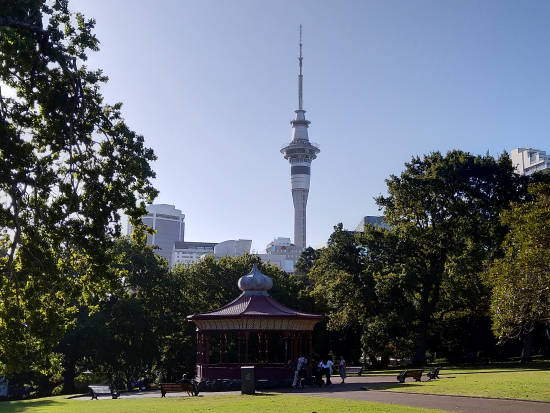

## About me

I am currently a second year student at the Hokkaido University studying at the [Modern Japanese studies Program](https://www.oia.hokudai.ac.jp/mjsp/).
I am also an avid traveler, and recently visited Sydney, Australia and Auckland, New Zealand.

### Countries I have visited

| 1-10              | 11-20          | 21-30                  | 31-40                    | 41-50                  | 51-             |
|-------------------|----------------|------------------------|--------------------------|------------------------|-----------------|
| 1. Sweden         | 11. Austria    | 21. Switzerland        | 31. Lithuania            | 41. Macedonia          | 51. Belize      |
| 2. Estonia        | 12. Slovakia   | 22. Hungary            | 32. Vatican              | 42. Serbia             | 52. Mexico      |
| 3. Russia         | 13. Germany    | 23. Latvia             | 33. Poland               | 43. Kosovo             | 53. Australia   |
| 4. Portugal       | 14.Malta       | 24. India              | 34. United Arab Emirates | 44. Andorra            | 54. New Zealand |
| 5. Spain          | 15. Italy      | 25. Croatia            | 35. Oman                 | 45. Romania            |                 |
| 6. United Kingdom | 16. Luxemburg  | 26. Montenegro         | 36. Taiwan               | 46. Denmark            |                 |
| 7. France         | 17. Belgium    | 27. Bosnia-Herzegovina | 37. Singapore            | 47. Slovenia           |                 |
| 8. Japan          | 18. Holland    | 28. Thailand           | 38. Indonesia            | 48. United States      |                 |
| 9. Czech          | 19. Ireland    | 29. Malesia            | 39. Greece               | 49. Bahamas            |                 |
| 10. South Korea   | 20. San Marino | 30. Norway             | 40. Turkey               | 50. Dominican republic |                 |

